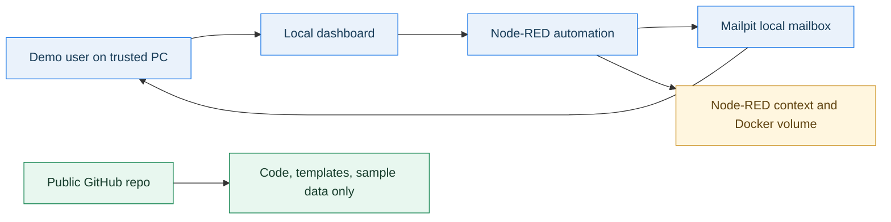
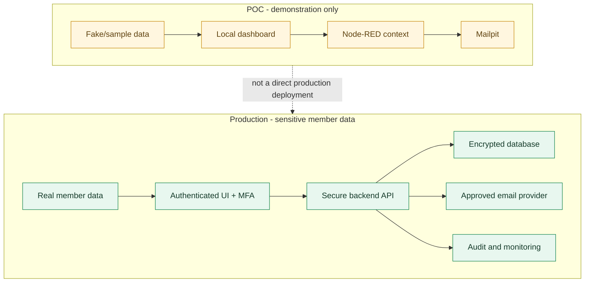
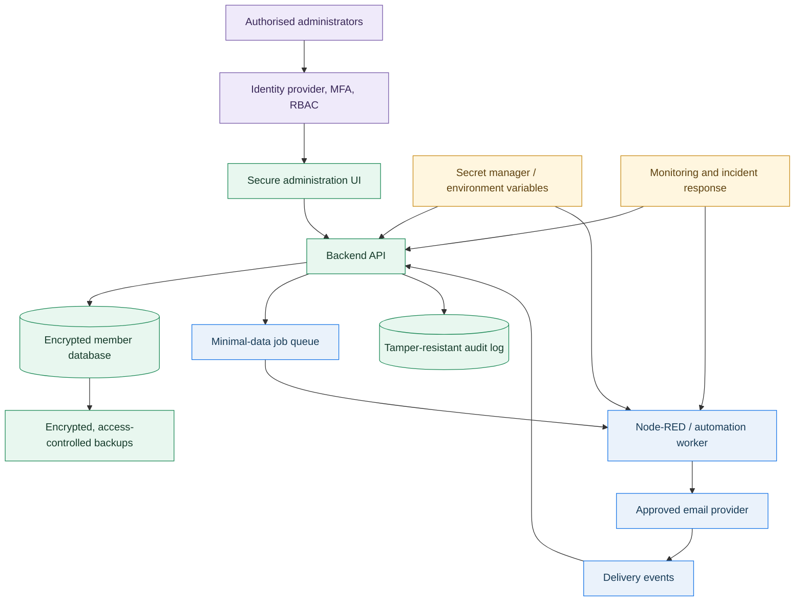
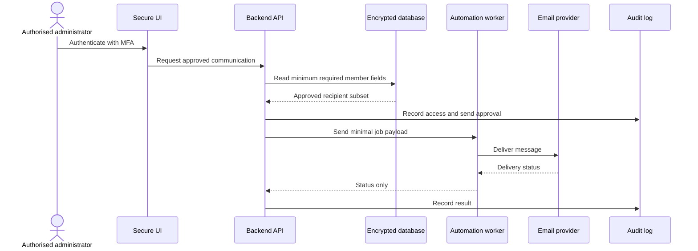

# Security and Compliance Position

## Purpose

This document explains why the current POC uses Node-RED, Mailpit, and safe-mode controls, and what must change before the system can process real member data for a political party registered in Germany.

This is not legal advice and does not certify compliance. It is a technical position paper for POC review and production planning.

## Executive Summary

The current implementation is suitable for a controlled demonstration with fake or sample data.

It is not approved for real political-party member data.

Political-party member records can reveal political affiliation or political opinions. Under GDPR, personal data revealing political opinions is special-category data and requires a much stronger legal, organisational, and technical protection model.

The production version should use a secure application and encrypted database as the system of record. Node-RED may remain useful as an automation worker, but it should not be the permanent store for sensitive member data.

## Why This POC Approach Was Selected

The POC intentionally uses:

- Node-RED for fast workflow prototyping and transparent automation logic
- Mailpit for local-only email testing
- Safe-mode settings to block live email
- Preview and approval phrase controls before sending
- Delivery history and run logs for operational visibility
- Backup/restore to prove portability
- SMTP readiness fields for planning only, without storing secrets

This makes the POC useful for demonstrating process automation while avoiding real email delivery and avoiding real member data.

### POC Architecture

The POC boundary is deliberately local. Only fake/sample data should enter this flow.

## Compliance-Relevant Baseline

For Germany/EU production planning, the relevant baseline includes:

- GDPR Article 9: special categories of personal data, including political opinions
- GDPR Article 25: data protection by design and by default
- GDPR Article 32: security of processing
- German BSI IT-Grundschutz / ISO 27001-style ISMS expectations for structured information security management

Useful references:

- GDPR Article 9 text via CNIL: https://www.cnil.fr/fr/reglement-europeen-protection-donnees/chapitre2
- GDPR Article 32 via European Data Protection Board: https://www.edpb.europa.eu/gdpr-articles/article-32-security-processing_nl
- Data protection by design/default overview: https://www.dataprotection.ie/en/organisations/know-your-obligations/data-protection-design-and-default
- BSI IT-Grundschutz Compendium: https://www.bsi.bund.de/SharedDocs/Downloads/EN/BSI/Grundschutz/International/bsi_it_gs_comp_2021.pdf?__blob=publicationFile&v=4

## Current POC Security Boundary

Allowed:

- fake contacts
- fake recipient groups
- fake meeting data
- local Mailpit email testing
- local demonstration on a trusted machine

Not allowed:

- real member data
- real political affiliation data
- production SMTP credentials
- exported backups containing real people
- public GitHub commits containing personal data
- running the dashboard as an internet-facing app

## Where Data Lives In The POC

In the POC, data is stored mainly inside the Node-RED Docker volume and Node-RED context storage.

This is acceptable for fake demo data, but not sufficient as the production source of truth for sensitive member records.

POC data locations:

- Node-RED context: contacts, groups, reminders, delivery metadata, settings
- Mailpit: local test emails
- local backup JSON files: exported POC backup data
- GitHub repo: code, templates, and sample data only

The GitHub repo must never contain real member data, secrets, or exported production backups.

### POC Versus Production

## Recommended Production Architecture

Recommended shape:

Production data should remain in:

- encrypted database hosted in Germany/EU or another approved jurisdiction
- access-controlled backups
- audit tables with limited retention
- secret manager or environment variables for credentials

Node-RED should:

- receive only the minimum data needed for an automation task
- not expose its editor publicly
- not store permanent member records as the authoritative database
- log only necessary operational metadata

## Required Production Controls

Minimum controls before real member data:

- documented lawful basis under GDPR Article 6
- documented Article 9 condition for processing political-affiliation/special-category data
- data protection impact assessment review if required
- Data Protection Officer or qualified legal/privacy review
- authentication for dashboard users
- MFA for administrators
- role-based access control
- HTTPS/TLS
- Node-RED admin authentication
- Node-RED editor not exposed publicly
- encrypted database storage
- encrypted backups
- backup access restrictions
- audit logging for view/create/update/delete/export actions
- export restrictions and approvals
- retention and deletion policy
- incident response process
- vendor Data Processing Agreements where vendors process personal data
- SMTP/API secrets stored outside the UI and outside Git

## Best-Practice Production Data Model

Suggested production data separation:

- `members`: member identity/contact data
- `communication_preferences`: consent, language, opt-in/out state
- `recipient_groups`: group membership references, not duplicated contact payloads
- `message_templates`: versioned templates without personal data
- `send_jobs`: queued notification jobs
- `delivery_events`: operational delivery status
- `audit_log`: security/admin actions

Sensitive fields should be minimised. Access should be scoped by role and purpose.

### Member Data Flow

## Backup And Export Rules

Backups and exports are high-risk because they can copy the entire membership list.

Production rules:

- backups encrypted at rest
- backup restore tested
- backup access limited to authorised administrators
- exports disabled by default
- exports require approval and audit logging
- exported files expire or are deleted after use
- no exports committed to GitHub
- no exports sent through ordinary email

## Email Provider Considerations

Before real email:

- verify sender domain
- configure SPF, DKIM, and DMARC
- choose an EU/Germany-acceptable provider or document transfer basis
- sign Data Processing Agreement if provider processes personal data
- start with one-recipient pilot
- monitor bounces, failures, and complaints

The current POC keeps SMTP readiness as planning metadata only and does not store SMTP passwords/API keys.

## What This POC Demonstrates Safely

The POC demonstrates:

- automation flow feasibility
- branded message generation
- timezone-aware meeting invitations
- birthday/reminder scheduling
- preview and approval flow
- operational logging
- backup/restore concept
- safe-mode design

It does not demonstrate:

- certified GDPR compliance
- ISO 27001 compliance
- BSI IT-Grundschutz compliance
- production authentication
- production encryption
- production retention/deletion processes
- real member-data processing approval

## Security And Compliance Roadmap

```mermaid
flowchart LR
    A["Safe POC<br/>fake data + Mailpit"] --> B["Data mapping and classification"]
    B --> C["GDPR lawful basis + Article 9 review"]
    C --> D["DPIA / DPO / legal review"]
    D --> E["Secure production architecture"]
    E --> F["Authentication, MFA, RBAC, TLS"]
    F --> G["Encrypted DB, backups, secrets, audit"]
    G --> H["Security and privacy testing"]
    H --> I["One-recipient real-email pilot"]
    I --> J["Formal approval and controlled rollout"]

    classDef current fill:#eaf2fb,stroke:#1473e6,color:#173b57;
    classDef governance fill:#efeafa,stroke:#7355a5,color:#382657;
    classDef security fill:#fff6df,stroke:#c88a14,color:#5f420f;
    classDef approval fill:#e8f7ef,stroke:#198754,color:#153b2a;

    class A current;
    class B,C,D governance;
    class E,F,G,H security;
    class I,J approval;
```

## Go/No-Go Position

Demo with fake data: Go.

Internal review with sample data: Go.

Real member data: No-go until the production controls above are designed, reviewed, implemented, and approved.

Public internet deployment: No-go in current form.

Real email pilot: Only after provider, domain, authentication, secrets handling, and one-recipient pilot controls are approved.
